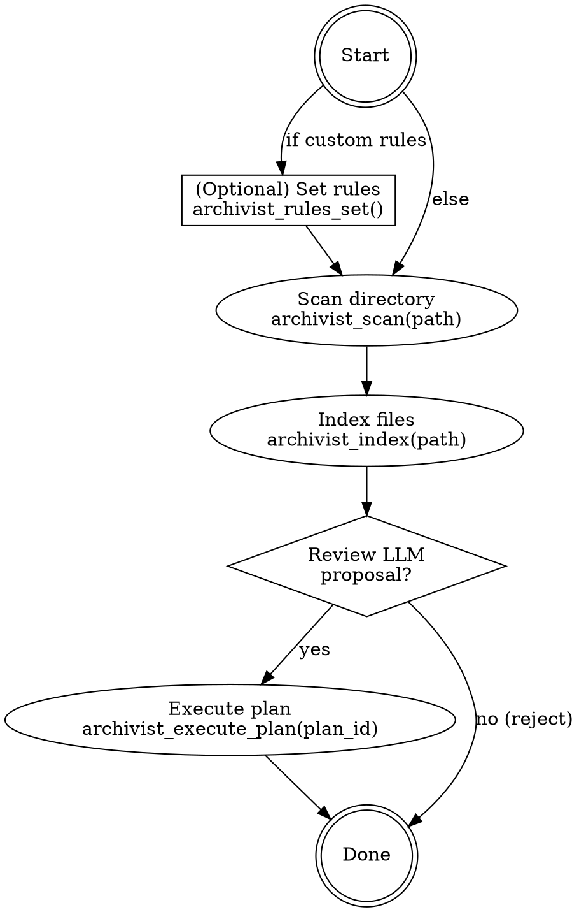

# Archivist File Organization

## Overview

**Archivist** is a context-aware file organization system that uses LLMs and semantic embeddings to intelligently place files. Instead of organizing by file type or extension, it analyzes content and learns from existing directory structures to make placement decisions.

**Core principle:** Files organized semantically (by meaning and context) are easier to find and maintain than files organized mechanically.

## When to Use

**Symptoms that indicate this skill applies:**
- Directory contains mixed file types that should be organized by topic/project
- Files have descriptive names but no logical folder structure
- Want to reorganize without knowing exact folder targets
- Multiple people/projects have contributed files with inconsistent naming
- Need audit trail showing WHY files were placed where they are

**Use cases:**
- Organizing research papers by topic and methodology
- Consolidating documents from email/downloads into project folders
- Categorizing invoices, contracts, tax documents by fiscal period
- Archiving project files with automatic summarization
- Deduplicating and consolidating versions of the same logical file

**When NOT to use:**
- Files are already well-organized (maintenance mode only)
- Organization rules are fully mechanical (pure file type sorting)
- Working with non-local files without setup (Google Drive requires auth)

## Core Workflow



## Quick Reference

### Basic Single-File Organization

```
1. Propose: archivist_propose(file_path)
   → Returns plan with action, destination, reasoning
2. Review the plan and reasoning
3. Execute: archivist_execute_plan(plan_id)
```

### Batch Organization with Custom Rules

```
1. Set rules: archivist_rules_set("Put tax documents in Finance/Tax/YYYY/")
2. Scan: archivist_scan(directory_path)
3. Index: archivist_index(directory_path)  # LLM analysis
4. For each file: archivist_propose() → archivist_execute_plan()
```

### Finding Similar Files (Before Organizing)

```
archivist_search("query describing what you're looking for")
→ Returns similar files with relevance scores
→ Helps understand existing organization before proposing changes
```

### Monitoring What Changed

```
archivist_log(last_n=20)  # See recent organization actions
archivist_cache_get(path)  # Check what files are indexed
```

## Implementation

### Step 1: Initial Setup

```
archivist_rules_set("Put research papers in Research/[Topic]/")
archivist_rules_set("Put invoices in Finance/Invoices/[YYYY]/")
```

Rules are optional but guide the LLM's decisions. Use specific folder patterns so LLM knows where targets exist.

### Step 2: Scan and Index

```
# Fast scan (no LLM cost)
archivist_scan("/Users/me/Downloads", depth=2)
→ Collects file metadata

# Heavy indexing (LLM analysis on each file)
archivist_index("/Users/me/Downloads")
→ Extracts content, summarizes, creates embeddings
→ Takes time; consider filtering by path first
```

**Cost note:** Indexing calls LLM once per file. For 1000 files at $0.03/1k tokens, expect $0.03-$0.10 depending on file sizes and model.

### Step 3: Propose Individual Files

```
plan = archivist_propose("/Users/me/Downloads/paper_2024.pdf",
                        target_root="/Users/me/Research")
→ Returns ActionPlan with:
  - action: "move" | "rename" | "create_dir" | "skip"
  - destination: "/Users/me/Research/ML/Vision/paper_2024.pdf"
  - confidence: 0.92
  - reasoning: "Content discusses vision transformers; placed in ML/Vision/"
  - plan_id: "abc123" (valid for 10 minutes)
```

### Step 4: Execute or Reject

```
# If you agree:
archivist_execute_plan(plan_id)

# If you disagree: just don't execute. Plan expires in 10 minutes.
# Next time, set stricter rules or use target_root to constrain options.
```

### Advanced: Semantic Search

Before organizing, search for similar files to understand existing structure:

```
archivist_search("machine learning papers from 2024", top_k=5)
→ Returns files with similar content
→ Shows you where similar items are already stored
→ Helps verify proposed placement makes sense
```

## Common Mistakes

### ❌ Indexing without thinking
- **Problem:** Indexing everything costs money (LLM calls). If you have 10,000 files, you pay per file.
- **Fix:** Use `depth` parameter to limit scope: `archivist_scan(path, depth=2)`
- **Fix:** Or target specific folders: `archivist_index("/Users/me/Research")` not entire disk

### ❌ No rules = inconsistent decisions
- **Problem:** Without rules, LLM has no constraints. File A goes to `Invoices/2024/` but File B goes to `Finance/Receipts/2024/`.
- **Fix:** Set rules first: `archivist_rules_set("All financial documents in Finance/[Document Type]/[YYYY]/")`
- **Fix:** Rules act as "guardrails" for LLM decisions

### ❌ Not checking reasoning before execution
- **Problem:** You execute a plan that moves `report.txt` to wrong folder because you didn't read the reasoning.
- **Fix:** Always review `reasoning` field in proposed plan before executing
- **Fix:** If reasoning doesn't match reality, set a rule to guide future decisions

### ❌ Trying to move files from multiple storage systems at once
- **Problem:** Local files + Google Drive need different setup. MCP tools work but auth matters.
- **Fix:** Organize local files first, then set up Google Drive connector separately
- **Fix:** Keep scopes small initially

### ❌ Expecting perfect organization from one pass
- **Problem:** First pass might place 80% correctly. Remaining 20% need rules refinement.
- **Fix:** Run in iterations: scan → index → propose → review → execute → check logs → refine rules → repeat
- **Fix:** Use `archivist_log()` to see what decisions were made and adjust rules

## Implementation Tips

### Iterative Refinement (Recommended for Large Sets)

```
Iteration 1:
  - Set basic rules
  - Propose 5-10 files
  - Review decisions
  - Identify pattern: "Things going to wrong folders because rule X was vague"

Iteration 2:
  - Refine rule X
  - Propose next batch
  - Repeat until rules are tight

Iteration 3:
  - Run batch organization on full directory
  - Confidence will be higher because rules are clear
```

### Cost Optimization

- **Scan is free:** Takes seconds, just reads filesystem metadata
- **Index is expensive:** Calls LLM per file. Index selectively by path
- **Propose caches results:** Same file proposed twice = first call has cost, second is free (cached 10 min)
- **Execute is free:** Just filesystem operations

### Verification Workflow

```
1. archivist_search("files to verify")
2. archivist_propose() - check reasoning
3. archivist_log() - see execution results
4. archivist_cache_get(path) - verify cache matches filesystem
```

If cache gets out of sync with filesystem (external changes):
```
archivist_cache_sync(path)
```

## Real-World Example

**Scenario:** Organizing 500 research papers and documents

```
Step 1: Set organization rules
  archivist_rules_set("Machine learning papers in Research/ML/[Subfield]/")
  archivist_rules_set("Conference papers in Research/Conferences/[Conference]/[Year]/")
  archivist_rules_set("Articles in Reading/Articles/[Topic]/")

Step 2: Scan the directory (free)
  archivist_scan("/Users/me/ResearchPapers", depth=3)
  → Found 500 files, 50 directories

Step 3: Index to enable semantic understanding (expensive but one-time)
  archivist_index("/Users/me/ResearchPapers")
  → Analyzed 500 files, created embeddings

Step 4: Sample a few proposals to verify rules are working
  archivist_propose("/Users/me/ResearchPapers/attention_2023.pdf")
  → Reasoning: "Content on attention mechanisms in transformers; placed in ML/NLP/"

  archivist_propose("/Users/me/ResearchPapers/icml_2024_abstract.txt")
  → Reasoning: "Conference paper from ICML 2024; placed in Conferences/ICML/2024/"

Step 5: Batch organize remaining files
  for file in /Users/me/ResearchPapers/*.pdf:
    plan = archivist_propose(file)
    if plan.confidence > 0.85:
      archivist_execute_plan(plan.plan_id)
    else:
      # Manual review for low-confidence decisions

Step 6: Verify what happened
  archivist_log(last_n=50)
  → See summary of 50 most recent placements with reasoning
```

**Result:** 500 papers organized by topic, conference, and type - fully auditable with reasoning for each decision.
